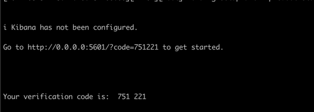
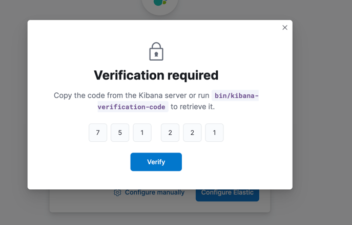

+++
title = "Cài đặt ELK stack"
date = 2024-08-31T22:02:02+07:00
weight = 1
chapter = false
pre = "<b>1. </b>"
+++

**Nội dung:**
- [Cài đặt Elasticsearch](#cài-đặt-elasticsearch)
- [Cài đặt Kibana](#cài-đặt-kibana)
---

#### Cài đặt Elasticsearch
```bash
create docker network:
docker network create elastic

pull docker image:
docker pull docker.elastic.co/elasticsearch/elasticsearch:8.15.0

run elaticsearch docker:
docker run --name es01 --net elastic -p 9200:9200 -it -m 1GB docker.elastic.co/elasticsearch/elasticsearch:8.15.0


export password: 
export ELASTIC_PASSWORD="eKuDlaj2DTy1hb5c0YTM"


copy cert to local machine:
docker cp es01:/usr/share/elasticsearch/config/certs/http_ca.crt .


set cert: 
curl --cacert http_ca.crt -u elastic:$ELASTIC_PASSWORD https://localhost:9200```
```

#### Cài đặt Kiabana
```bash
pull docker image:
docker pull docker.elastic.co/kibana/kibana:8.15.0

run kibana docker:
docker run --name kib01 --net elastic -e ELASTICSEARCH_HOSTS=http://localhost:9200 -p 5601:5601 -it docker.elastic.co/kibana/kibana:8.15.0

khi run xong, truy cập vào http://localhost:5601/ để xem kibana
lúc đó sẽ yêu cầu nhập token của elasticsearch

để lấy lại token của elasticsearch, chạy lệnh sau:
docker exec -it es01 /usr/share/elasticsearch/bin/elasticsearch-create-enrollment-token -s kibana

sau đó copy token và nhập vào trang web kibana
tiếp theo sẽ yêu cầu nhập mã pin, mã pin được hiển thị ở log của kibana trong docker




Khi đó ta hoàn thành cài đặt kibana và elasticsearch
```

+ Tiếp theo chúng ta sẽ cài đặt [Suricata](../filebeat/#cài-đặt-suricata) và [filebeat](../filebeat/#cài-đặt-filebeat) để thu thập log từ Suricata và chuyển đến elasticsearch

